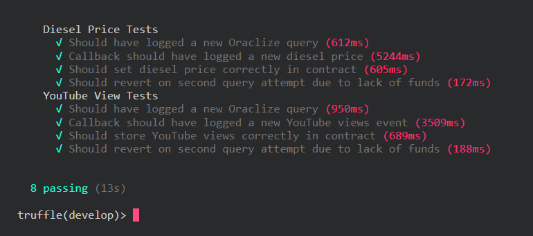

# :package: Oraclize Truffle Box

&nbsp;

The Oraclize Truffle box is here! We have created this starter-box to show you how to leverage Oraclize within the Truffle framework. It contains the Oraclize API as well as an example smart-contract. There are tests included too showing you how you could set up a full ethereum smart-contract development suite of your own. Get leveraging the power of Oraclize in your smart-contract projects today!

&nbsp;

***

&nbsp;

### :page_with_curl: __Instructions For Unboxing__

**1)** Using your favourite shell, first install Truffle globally:

_**`❍ npm install -g truffle`**_

**2)** Then create a directory you want to install the box into:

_**`❍ mkdir my-awesome-oraclize-truffle-box`**_

**3)** Enter the directory: 

_**`❍ cd my-awesome-oraclize-truffle-box`**_

**4)** Unbox it!

_**`❍ truffle unbox oraclize/truffle-starter`**_

Now is a great time to have a look around the your new Oraclize box. You'll see all the Truffle files & folder structure you're used to. Congratulations - you can now compile, migrate and deploy your contracts to your heart's content!

&nbsp;

***

&nbsp;

### :mortar_board: __How To Use - Test Running Example__

When you unboxed this, it installed the dependencies it needs including another part of the Oraclize ecosystem that we call the __*[Ethereum-Bridge](https://github.com/oraclize/ethereum-bridge)*__. It allows you to test Oraclize functionality on local test-nets! Also, did you know that Truffle can spin up a local ethereum-blockchain itself in order to speed up development and run tests? These things combined are super useful when developing your smart-contracts, as a fast test-turnover incentivizes more thorough testing which is _always_ a good thing! 

To help even more, we've written a script inside the *`package.json`* that came inside your Truffle box - go and have a peek at it now. It'll start the bridge with the right settings which will make your work super easy and fast, watch:

**1)** Point your console to your project's directory then start Truffle in develop mode by running:

_**`❍ truffle develop`**_

**2)** Once Truffle is fired up, in a __*new*__ console, create the bridge via:

_**`❍ npm run bridge`**_

**2)** Once the bridge is up, running and listening, go back to the first console and run the tests via: 

_**`❍ truffle develop> test`**_

<!-- ### :fire: :boom: :fire: -->

:white_check_mark: The more green . . .

:white_check_mark: check marks . . .

:white_check_mark: the better!!

Afer you've watched the tests run, go and have a look in the test directory to see the javascript file that contains them. Notice the *`waitForEvent`* function in the *`./test/utils.js`* folder too - it means we can wait for events to see what values Oraclize calls are returning! 

&nbsp;

***

&nbsp;

### :computer: __Get Developing!__ 

Now that you've seen the contents of the Oraclize box in action, you'll be itching to get on with your own projects. Just remember that if you're using Oraclize queries in your smart-contracts, you'll need the ethereum-bridge running _along side_ the truffle development console. The bridge is also highly configurable to suit the dev environment & version of the ethereum blockchain you're using - you can find out __*[all of it's options here](https://github.com/oraclize/ethereum-bridge)*__.

There are also tons of other resources to help you out, including:

:punch: The __*[Oraclize docs](https://docs.oraclize.it/)*__!

:punch: The __*[Truffle docs](https://truffleframework.com/docs)*__!

:punch: And more of our __*[example contracts](https://github.com/oraclize/ethereum-examples)*__!

If you get stuck after looking through the above sources, feel free to ask us questions on __*[our Gitter support channel](https://gitter.im/oraclize/ethereum-api)*__!

With just this truffle-box you can quickly and easily be leveraging the full power of Oraclize in your smart-contracts - have fun! 

&nbsp;

***

&nbsp;

### :mega: __Get In Touch!__

If you want to tell us something, or ask us something, there's loads of ways to get in touch:

__❍__ We have a __*[Twitter](https://twitter.com/oraclizeit)*__

__❍__ And a __*[Gitter](https://gitter.im/oraclize/ethereum-api)*__

__❍__ Or a __*[Website](https://oraclize.it)*__

__❍__ Plus a __*[Github](https://github.com/oraclize)*__
